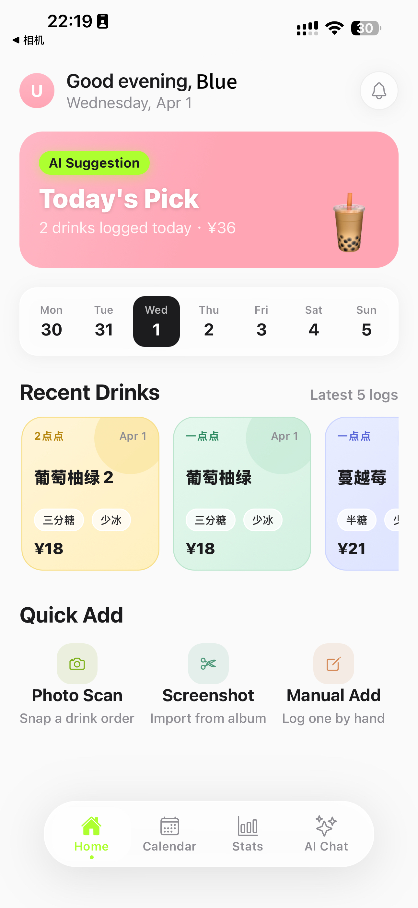
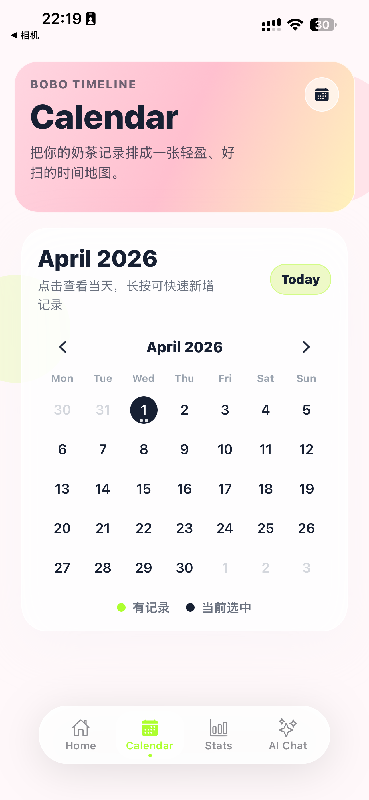
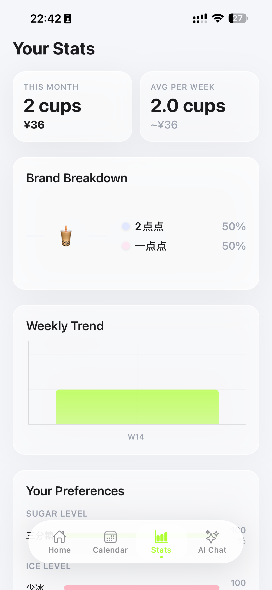

# Bobo Agent

> AI 驱动的个人饮品记录助手 — 拍照记录、数据分析、智能对话，一站搞定。你的奶茶记录ai助手+奶茶推荐官！

**Bobo Agent** 是一款全栈移动agent应用，用拍照/截图自动识别替代繁琐的手动记账，提供丰富的消费分析看板，以及一个能记住你口味的 AI 助手。

| Home | Calendar | Stats |
| --- | --- | --- |
|  |  |  |

---

## 核心亮点

- **拍照即记录** — 拍杯贴或截图外卖订单，视觉模型自动提取品牌、品名、规格、糖度、冰度、价格。
- **日历 & 统计** — 月历品牌彩点、每日时间线、品牌饼图、周趋势柱状图、糖冰偏好条形图、月度消费热力图。
- **AI 对话 + 工具调用** — 基于 LangGraph 的智能体，能搜菜单、记录饮品、查统计、给个性化推荐，全程 SSE 流式输出。
- **混合长期记忆** — 三层记忆架构（用户画像 / 带 TTL 的事实条目 / 滚动对话摘要），助手越用越懂你。
- **菜单语义检索** — 基于 Embedding + Qdrant 的 RAG 检索，支持「清爽的水果茶」等自然语言查询。
- **MCP 工具层** — 所有 Agent 能力通过 FastMCP 暴露为标准 [MCP](https://modelcontextprotocol.io) 工具，配合 Capability 机制做细粒度权限控制。

---

## 系统架构

```
┌─────────────────────────────────────────────────────────┐
│                   移动端 App（Expo）                      │
│         Home  ·  Calendar  ·  Stats  ·  AI Chat         │
└──────────────────────┬──────────────────────────────────┘
                       │ HTTPS / SSE
┌──────────────────────▼──────────────────────────────────┐
│               后端 API（FastAPI）                         │
│   Auth · Records · Vision · Menu · Agent · Memory       │
│                                                         │
│   LangGraph Agent ←→ FastMCP Tool Server (/mcp)         │
└────┬──────────┬──────────┬──────────┬───────────────────┘
     │          │          │          │
PostgreSQL   Qdrant     Redis    腾讯云 COS
 (业务数据)  (向量检索)  (缓存)    (图片存储)
                        │
             Qwen-VL-Max / Qwen3 / OpenAI
               (视觉识别 / 语言模型)
```

---

## 技术栈

| 层级 | 技术选型 |
|------|---------|
| **移动端** | React Native, Expo, Expo Router, TypeScript, React Query, Zustand, NativeWind, Victory Native |
| **后端** | Python 3.12, FastAPI, LangGraph, FastMCP, SQLModel, Psycopg 3 |
| **数据层** | PostgreSQL, Qdrant, Redis |
| **AI 模型** | Qwen-VL-Max（视觉识别）, Qwen3-32B（对话）, OpenAI Embeddings |
| **基础设施** | Docker Compose, Nginx, 腾讯云 COS |

---

## 快速开始

### 环境要求

- macOS（iOS 模拟器需要）
- Docker & Docker Compose
- Python 3.12+
- Node.js 20+
- Xcode（iOS）或 Expo Go（真机）

### 1. 克隆仓库

```bash
git clone <your-public-repo-url> bobo-agent-public
cd bobo-agent-public
bash scripts/dev_local.sh init
```

脚本会优先从 `.env.local.example` 生成 `.env.local`；如果前者不存在，才会回退到 `.env.example`。

生成的 `.env.local` 已自动改成适合宿主机直连 Docker 服务的本地地址：

- PostgreSQL: `127.0.0.1:15432`
- Redis: `127.0.0.1:16379`
- Qdrant: `127.0.0.1:16333`

如需使用视觉识别、Agent 或向量检索，请补充 `.env.local` 里的模型 / 存储相关密钥。

### 2. 启动基础设施

```bash
bash scripts/dev_local.sh up
```

启动 PostgreSQL (`:15432`)、Redis (`:16379`)、Qdrant (`:16333`)。

### 3. 启动后端

```bash
bash scripts/dev_local.sh backend
```

验证：`curl http://127.0.0.1:8000/bobo/health` 应返回 `{"ok": true}`。

API 文档：[http://127.0.0.1:8000/docs](http://127.0.0.1:8000/docs)

### 4. 启动移动端

```bash
# iOS 模拟器
bash scripts/run_mobile_local.sh simulator

# 真机调试（自动探测局域网 IP）
bash scripts/run_mobile_local.sh device
```

---

## 仓库结构

```text
bobo-agent-public/
├── backend/                    # FastAPI 后端
│   ├── alembic/                # Alembic 配置
│   ├── app/
│   │   ├── agent/              # LangGraph 状态机、节点、状态定义
│   │   ├── api/                # 路由层（auth, records, vision, menu, agent, memory）
│   │   ├── core/               # 配置、安全、鉴权
│   │   ├── memory/             # 画像、摘要、提取、检索
│   │   ├── models/             # 数据模型 & Pydantic Schema
│   │   ├── services/           # Vision, Embedding, Qdrant, COS, 菜单操作
│   │   ├── tooling/            # 共享工具实现层 & 注册表
│   │   └── tools/              # FastMCP Server（挂载在 /mcp）
│   ├── bobo_backend.egg-info/  # 本地构建生成的包元数据
│   ├── scripts/                # 菜单导入 / 抓包提取脚本
│   ├── tests/                  # 后端测试
│   ├── Dockerfile
│   └── pyproject.toml
├── infra/                      # Docker Compose、Nginx、部署脚本
│   ├── nginx/
│   └── scripts/
├── mobile/                     # Expo React Native 移动端
│   ├── app/                    # Expo Router 页面
│   ├── assets/                 # 图标资源
│   ├── components/             # UI 组件 & 图表
│   ├── hooks/                  # 预留 hooks 目录
│   ├── lib/                    # API、运行时配置、上传辅助
│   ├── stores/                 # Zustand 状态管理
│   ├── app.json
│   └── package.json
├── scripts/                    # 本地开发启动脚本
├── .env.local.example          # 本地开发环境变量模板
├── .env.example                # 环境变量模板
├── LICENSE
└── README.md
```

---

## 接口概览

| 模块 | 端点 |
|------|------|
| **健康检查** | `GET /bobo/health` |
| **认证** | `POST /bobo/auth/login` · `register` · `refresh` |
| **记录** | `POST /bobo/records/confirm` · `GET day` · `calendar` · `stats` |
| **视觉识别** | `POST /bobo/upload-url` · `POST /bobo/vision/recognize` |
| **菜单** | `GET /bobo/menu/search` · `POST` · `PUT` · `DELETE` |
| **Agent** | `POST /bobo/agent/chat`（SSE 流式） |
| **记忆** | Threads CRUD · Profile CRUD · Memory Items CRUD |
| **MCP** | `POST /mcp`（Streamable HTTP, FastMCP） |

---

## 菜单数据管线

```
抓包捕获（Reqable / Charles）
  → 手动清洗为标准 JSON
  → 导入 PostgreSQL
  → 向量化并同步到 Qdrant
```

公开仓库仅保留通用导入脚本，不包含品牌抓包原始文件；菜单导入前需要整理为以下标准 JSON 格式：

```json
{
  "brand": "heytea",
  "source_file": "heytea-menu-capture.har",
  "generated_at": "2026-04-01T12:00:00+08:00",
  "items": [
    {
      "brand": "heytea",
      "name": "多肉葡萄",
      "size": "中杯",
      "price": 19.0,
      "description": "葡萄果肉搭配绿妍茶底",
      "sugar_opts": ["正常糖", "少糖", "无糖"],
      "ice_opts": ["正常冰", "少冰", "去冰"],
      "is_active": true
    }
  ]
}
```

字段约定：

- 顶层 `brand`：本次菜单所属品牌，建议使用稳定的小写英文或拼音标识。
- 顶层 `source_file`：原始抓包文件名或来源说明，便于追溯。
- 顶层 `generated_at`：生成标准 JSON 的时间，建议使用 ISO 8601。
- 顶层 `items`：菜单项数组。
- `items[].brand`：品牌名，通常与顶层 `brand` 保持一致。
- `items[].name`：饮品名，必填。
- `items[].size`：杯型或规格，可为空或设为 `null`。
- `items[].price`：价格，使用数字类型，保留到分。
- `items[].description`：商品描述，可为空或设为 `null`。
- `items[].sugar_opts`：糖度选项数组，没有可传空数组 `[]`。
- `items[].ice_opts`：冰度选项数组，没有可传空数组 `[]`。
- `items[].is_active`：是否仍在售，使用布尔值。

导入建议：

- 以 `brand + name + size` 作为去重键。
- `price` 使用数值，不要写 `"19元"` 这类带单位字符串。
- 缺失字段优先使用 `null` 或空数组，不要混用空字符串和中文占位词。
- 同一品牌的字段命名和规格口径尽量保持一致，便于数据库导入和向量检索。

---

## 安全

- 除 `/bobo/auth/login`、`/bobo/health`、`/docs` 外，所有端点均需 `Authorization: Bearer <JWT>`。
- `/mcp` 受保护，基于 Capability 的权限控制区分普通用户与管理员。
- 图片上传使用预签名 URL，客户端不接触存储密钥。
- Token 存储在 iOS SecureStore，自动刷新对用户透明。

**禁止提交：** `.env*`（示例文件除外）、私钥、`.har`/`.pcap` 文件、`data/` 目录。

---

## License

MIT
